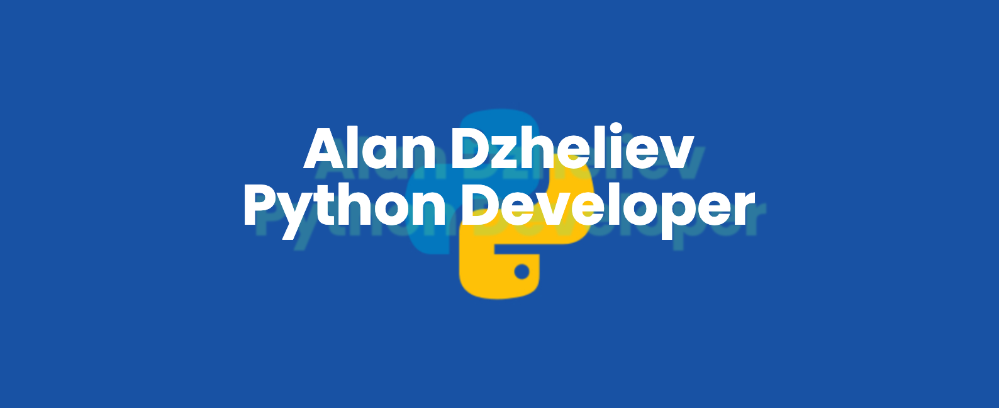

____

    

---

# Привет, меня зовут Алан!

---

### :man_technologist: Обо мне:

Я начинающий Python разработчик. Мой путь в it начался в 2022г., когда товарищ просто предложил мне воспользоваться скидкой на обучение в одной из школ программирования. Я начал обучаться профессии DevOps инженера, пощупал CI/CD, но вскоре понял, что меня больше цепляет именно написание своего кода. Процесс этот увлёк меня настолько, что я принял решение сменить специальность, которой посвятил более 15 лет. C начала 2023г я плотно изучал разработку на Python, фреймворки Django и Flask на курсах Skillbox. В настоящий момент мое обучение на курсе практически завершено и я нахожусь в поиске работы!

 

- :seedling: Завершаю курсы по разработке на Python в Skillbox!

- :zap: Имею более чем 15-летний стаж в сфере переводов и локализации до перехода в разработку.

- :mailbox: Как связаться со мной:    

---

### 🤝 Социальные сети:

  

    
    
  

---

### 💻 Технологии:

    &nbsp
    &nbsp
    &nbsp
    &nbsp
    &nbsp
    &nbsp
    &nbsp

---

### 🛠 Инструменты:

    &nbsp;
    &nbsp;
    &nbsp;
    &nbsp;
    
    
    
    &nbsp;

---

### ⚙️ GitHub статистика:

<table>
  <tr>
    <td>
      
    </td>
  </tr>
</table>

---
<picture>
<source
  srcset="https://github-readme-stats.vercel.app/api?username=adzheliev&show_icons=true&theme=dark"
  media="(prefers-color-scheme: dark)"
/>
<source
  srcset="https://github-readme-stats.vercel.app/api?username=adzheliev&show_icons=true"
  media="(prefers-color-scheme: light), (prefers-color-scheme: no-preference)"
/>

</picture>

---

---

